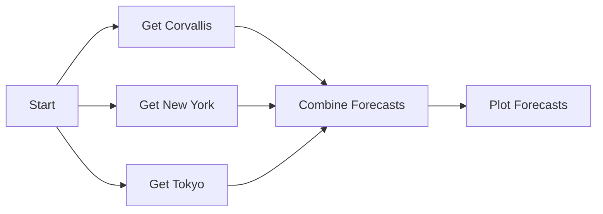

# Open-Meteo Multi-City Forecast Workflow

## Table of Contents

- [Key Topics](#key-topics)
- [Introduction](#introduction)
- [Prerequisites](#prerequisites)
- [Understanding our Data](#understanding-our-data)
- [Writing our Functions](#writing-our-functions)
  - [1. Start the Workflow](#1-start-the-workflow)
  - [2. Get a City Forecast](#2-get-a-city-forecast)
  - [3. Combine City Forecasts](#3-combine-city-forecasts)
  - [4. Plot the Forecast Comparison](#4-plot-the-forecast-comparison)
- [Building our Workflow](#building-our-workflow)
  - [1. Set Up our Compute Server](#1-set-up-our-compute-server)
  - [2. Set Up our Data Store](#2-set-up-our-data-store)
  - [3. Add our Functions](#3-add-our-functions)
  - [4. Connect our Functions](#4-connect-our-functions)
  - [5. Finalize our Workflow Configuration](#5-finalize-our-workflow-configuration)
- [Download and Invoke the Workflow](#download-and-invoke-the-workflow)
  - [Download the Workflow](#download-the-workflow)
  - [Register and Invoke the Workflow](#register-and-invoke-the-workflow)
  - [View the Output Data](#view-the-output-data)
- [Create a Weekly Scheduled Forecast Archive](#create-a-weekly-scheduled-forecast-archive)
  - [Updating our Function Code for Archiving](#updating-our-function-code-for-archiving)
  - [Updating our Workflow for Archiving](#updating-our-workflow-for-archiving)
  - [Register the Weekly Workflow](#register-the-weekly-workflow)
  - [Setting a Weekly Timer with FaaSr-workflow](#setting-a-weekly-timer-with-faasr-workflow)
  - [Verify Scheduled Runs and Archive Outputs](#verify-scheduled-runs-and-archive-outputs)
  - [Unsetting the Timer](#unsetting-the-timer)

## Key Topics

- Writing R functions for FaaSr
- Calling an external forecast API (Open-Meteo)
- Invoking multiple functions in parallel
- Duplicating functions in the Workflow Builder
- Adding CRAN and GitHub R packages
- Workflow Builder GUI
- Combining multi-city outputs and creating a visualization
- Scheduling workflows weekly with `(FAASR SET TIMER)`

## Introduction

The Open-Meteo Multi-City Forecast Workflow is an example of a common FaaSr use case in R: pull live weather forecasts for several cities, combine them, and produce a comparison visualization that is uploaded to S3. This tutorial is a walkthrough of creating your own workflow, from writing the code to viewing its outputs.

Unlike the [Weather Visualization](https://github.com/FaaSr/FaaSr-Functions/tree/main/WeatherVisualization) example (Python + historical NOAA station data), this workflow focuses on **live forecasts** from the [Open-Meteo](https://open-meteo.com/) API, multi-city parallel fetches, and an R/`tidyverse` analysis path.



This tutorial also includes a section on creating a workflow variant:

- **Weekly Scheduled Forecast Archive** (see [Create a Weekly Scheduled Forecast Archive](#create-a-weekly-scheduled-forecast-archive)): Demonstrates how to write each run under a date-stamped S3 prefix and invoke the workflow every week using `(FAASR SET TIMER)` in your `FaaSr-workflow` repository.

## Prerequisites

This example function assumes you already completed the FaaSr tutorial ([https://faasr.io/FaaSr-Docs/tutorial/](https://faasr.io/FaaSr-Docs/tutorial/)) and have the necessary repositories and configuration set up. This tutorial will use the `dekkov/openmeteo_faasr` repo as the function code source repository, but you may use your own repository as you follow along.

## Understanding our Data

For this tutorial, we use the [Open-Meteo Weather Forecast API](https://open-meteo.com/en/docs). Open-Meteo provides free weather forecast data over HTTP with no API key for non-commercial use.

We will request **daily** variables for each city:

- `temperature_2m_max`
- `temperature_2m_min`
- `precipitation_sum`

In R, we call Open-Meteo through the [`tpisel/openmeteo`](https://github.com/tpisel/openmeteo) package. FaaSr installs that package at runtime via `FunctionGitHubPackage`. Location arguments may be place names (for example, `Corvallis`) or `"lat,lon"` coordinate pairs.

For this tutorial we will fetch forecasts for three cities:

- Corvallis
- New York
- Tokyo

Each fetch writes a CSV to S3. A later action combines those CSVs, and a final action builds a comparison plot (`forecast_comparison.png`).

> ℹ️ Open-Meteo data is licensed under [CC BY 4.0](https://creativecommons.org/licenses/by/4.0/). If you redistribute results, include attribution to Open-Meteo.

## Writing our Functions

### 1. Start the Workflow

The first function is a lightweight entry point that fans out to the parallel city fetches. The complete function can be found in [start_forecast.R](./R/start_forecast.R).

```r
start_forecast <- function() {
  # Lightweight entry point: FaaSr needs one action to fan out to parallel city fetches.
  faasr_log("Starting Open-Meteo multi-city forecast workflow")
}
```

> ℹ️ FaaSr workflows have a single entry-point action. Because our three city fetches should run in parallel, we use a small `Start` action whose only job is to invoke the next three actions.

### 2. Get a City Forecast

The second function fetches an Open-Meteo forecast for one location and uploads it to S3. The complete function can be found in [get_weather_forecast.R](./R/get_weather_forecast.R).

First, we load packages. `openmeteo` is installed by FaaSr from GitHub; `tidyverse` is installed from CRAN:

```r
library(openmeteo)
library(tidyverse)
```

Next, we optionally nest outputs under a date-stamped archive folder (used later for the weekly schedule), and we accept either a place name or a `"lat,lon"` pair because FaaSr passes function arguments as strings:

```r
# Optionally nest outputs under archive/YYYY-MM-DD so scheduled runs do not overwrite.
resolve_folder <- function(folder, use_archive) {
  if (isTRUE(as.logical(use_archive))) {
    paste0(folder, "/archive/", format(Sys.Date(), "%Y-%m-%d"))
  } else {
    folder
  }
}

# FaaSr passes arguments as strings. Accept either a place name ("Tokyo")
# or a "lat,lon" coordinate pair ("40.71,-74.01").
parse_location <- function(loc) {
  loc <- trimws(loc)
  parts <- strsplit(loc, ",", fixed = TRUE)[[1]]
  if (length(parts) == 2) {
    nums <- suppressWarnings(as.numeric(trimws(parts)))
    if (!any(is.na(nums))) {
      return(nums)
    }
  }
  loc
}
```

Finally, we put everything together in a single function that:

1. Resolves the remote folder (with or without archive prefix).
2. Parses the location argument.
3. Requests a daily forecast from Open-Meteo.
4. Writes a local CSV and uploads it with `faasr_put_file`.

This function will be called by FaaSr once per city, so we configure `folder`, `location`, and `output_file` when building our workflow.

```r
get_weather_forecast <- function(folder, location, output_file, use_archive = "FALSE") {
  library(openmeteo)
  library(tidyverse)

  resolve_folder <- function(folder, use_archive) {
    if (isTRUE(as.logical(use_archive))) {
      paste0(folder, "/archive/", format(Sys.Date(), "%Y-%m-%d"))
    } else {
      folder
    }
  }

  parse_location <- function(loc) {
    loc <- trimws(loc)
    parts <- strsplit(loc, ",", fixed = TRUE)[[1]]
    if (length(parts) == 2) {
      nums <- suppressWarnings(as.numeric(trimws(parts)))
      if (!any(is.na(nums))) {
        return(nums)
      }
    }
    loc
  }

  remote_folder <- resolve_folder(folder, use_archive)
  location_label <- as.character(location)
  location_parsed <- parse_location(location)

  forecast <- weather_forecast(
    location_parsed,
    daily = c("temperature_2m_max", "temperature_2m_min", "precipitation_sum")
  ) %>%
    mutate(location = location_label)

  local_file <- "weather_forecast.csv"
  write_csv(forecast, local_file)

  faasr_put_file(local_file = local_file, remote_folder = remote_folder, remote_file = output_file)

  log_msg <- paste0(
    "Function get_weather_forecast finished; forecast for '", location_label,
    "' written to ", remote_folder, "/", output_file, " in default S3 bucket"
  )
  faasr_log(log_msg)
}
```

### 3. Combine City Forecasts

The third function downloads the per-city CSV files from S3 and binds them into one table. The complete function can be found in [combine_forecasts.R](./R/combine_forecasts.R).

```r
combine_forecasts <- function(
    folder,
    input_loc1,
    input_loc2,
    input_loc3,
    output_file,
    use_archive = "FALSE") {
  library(tidyverse)

  # Keep the same archive prefix as the city-fetch actions when use_archive is TRUE.
  resolve_folder <- function(folder, use_archive) {
    if (isTRUE(as.logical(use_archive))) {
      paste0(folder, "/archive/", format(Sys.Date(), "%Y-%m-%d"))
    } else {
      folder
    }
  }

  remote_folder <- resolve_folder(folder, use_archive)

  faasr_get_file(remote_folder = remote_folder, remote_file = input_loc1, local_file = "forecast_loc1.csv")
  faasr_get_file(remote_folder = remote_folder, remote_file = input_loc2, local_file = "forecast_loc2.csv")
  faasr_get_file(remote_folder = remote_folder, remote_file = input_loc3, local_file = "forecast_loc3.csv")

  forecast_loc1 <- read_csv("forecast_loc1.csv")
  forecast_loc2 <- read_csv("forecast_loc2.csv")
  forecast_loc3 <- read_csv("forecast_loc3.csv")

  # Align column classes so bind_rows does not fail across city files.
  forecasts <- list(forecast_loc1, forecast_loc2, forecast_loc3)
  common_cols <- Reduce(intersect, lapply(forecasts, names))
  for (col in common_cols) {
    classes <- unique(vapply(
      forecasts,
      function(df) paste(class(df[[col]]), collapse = "/"),
      character(1)
    ))
    if (length(classes) > 1) {
      forecast_loc1[[col]] <- as.character(forecast_loc1[[col]])
      forecast_loc2[[col]] <- as.character(forecast_loc2[[col]])
      forecast_loc3[[col]] <- as.character(forecast_loc3[[col]])
    }
  }

  forecast_combined <- bind_rows(forecast_loc1, forecast_loc2, forecast_loc3)

  local_file <- "forecast_combined.csv"
  write_csv(forecast_combined, local_file)
  faasr_put_file(local_file = local_file, remote_folder = remote_folder, remote_file = output_file)

  log_msg <- paste0(
    "Function combine_forecasts finished; combined forecast written to ",
    remote_folder, "/", output_file, " in default S3 bucket"
  )
  faasr_log(log_msg)
}
```

> ℹ️ `CombineForecasts` is invoked by each of the three city actions. FaaSr waits until all predecessors finish before running it once — the same barrier pattern used by `PlotData` in the Weather Visualization example.

### 4. Plot the Forecast Comparison

The final function reads the combined CSV and creates a multi-panel comparison plot with `ggplot2` (via `tidyverse`). The complete function can be found in [plot_forecasts.R](./R/plot_forecasts.R).

At a high level, this function:

1. Downloads `combined_forecasts.csv` with `faasr_get_file`.
2. Builds a faceted line plot of maximum temperature and precipitation by city.
3. Saves a PNG with `ggsave` and uploads it with `faasr_put_file`.

```r
plot_forecasts <- function(folder, input_file, output_file, use_archive = "FALSE") {
  library(tidyverse)

  # Keep the same archive prefix as earlier actions when use_archive is TRUE.
  resolve_folder <- function(folder, use_archive) {
    if (isTRUE(as.logical(use_archive))) {
      paste0(folder, "/archive/", format(Sys.Date(), "%Y-%m-%d"))
    } else {
      folder
    }
  }

  remote_folder <- resolve_folder(folder, use_archive)

  faasr_get_file(
    remote_folder = remote_folder,
    remote_file = input_file,
    local_file = "forecast_combined.csv"
  )

  forecast <- read_csv("forecast_combined.csv")

  # openmeteo column names can vary slightly by package version; normalize aliases.
  if (!"date" %in% names(forecast) && "time" %in% names(forecast)) {
    forecast <- forecast %>% rename(date = time)
  }
  if (!"location" %in% names(forecast)) {
    stop("Combined forecast is missing a 'location' column")
  }

  temp_max_col <- intersect(c("temperature_2m_max", "temp_max"), names(forecast))
  precip_col <- intersect(c("precipitation_sum", "precipitation"), names(forecast))

  if (length(temp_max_col) == 0) {
    stop("Combined forecast is missing a daily maximum temperature column")
  }

  forecast <- forecast %>%
    mutate(date = as.Date(date))

  plot_df <- forecast %>%
    select(
      date,
      location,
      max_temp = all_of(temp_max_col[[1]]),
      precip = any_of(precip_col)
    )

  if ("precip" %in% names(plot_df)) {
    # Facet temperature and precipitation so both metrics share one PNG.
    plot_df <- plot_df %>%
      pivot_longer(
        cols = c(max_temp, precip),
        names_to = "metric",
        values_to = "value"
      ) %>%
      mutate(
        metric = recode(
          metric,
          max_temp = "Max temperature (°C)",
          precip = "Precipitation (mm)"
        )
      )

    forecast_plot <- ggplot(plot_df, aes(x = date, y = value, color = location)) +
      geom_line(linewidth = 1) +
      geom_point(size = 2) +
      facet_wrap(~metric, scales = "free_y", ncol = 1) +
      labs(
        title = "Open-Meteo multi-city forecast comparison",
        x = "Date",
        y = NULL,
        color = "Location"
      ) +
      theme_minimal(base_size = 12) +
      theme(legend.position = "bottom")
  } else {
    forecast_plot <- ggplot(plot_df, aes(x = date, y = max_temp, color = location)) +
      geom_line(linewidth = 1) +
      geom_point(size = 2) +
      labs(
        title = "Open-Meteo daily maximum temperature forecast",
        x = "Date",
        y = "Max temperature (°C)",
        color = "Location"
      ) +
      theme_minimal(base_size = 12) +
      theme(legend.position = "bottom")
  }

  local_file <- "forecast_comparison.png"
  ggsave(filename = local_file, plot = forecast_plot, width = 10, height = 8, dpi = 150)

  faasr_put_file(local_file = local_file, remote_folder = remote_folder, remote_file = output_file)

  log_msg <- paste0(
    "Function plot_forecasts finished; comparison plot written to ",
    remote_folder, "/", output_file, " in default S3 bucket"
  )
  faasr_log(log_msg)
}
```

## Building our Workflow

Now that we wrote our functions, we are ready to build our workflow using the FaaSr Workflow Builder: [https://faasr.io/FaaSr-workflow-builder/](https://faasr.io/FaaSr-workflow-builder/).

The final workflow file that we will create can be found in [OpenMeteoForecast.json](./OpenMeteoForecast.json). Before getting started, you can visualize this workflow by clicking **Upload** from the Workflow Builder and either uploading the file or importing from its GitHub URL:

`https://github.com/dekkov/openmeteo_faasr/blob/main/OpenMeteoForecast.json`

> ℹ️ As you make changes to your workflow, you can click the **vertical layout** or **horizontal layout** controls at the top of the right-hand layout view to re-arrange the layout with your changes.  
> ℹ️ Source for the Workflow Builder is at [https://github.com/FaaSr/FaaSr-workflow-builder](https://github.com/FaaSr/FaaSr-workflow-builder).

### 1. Set Up our Compute Server

After opening the Workflow Builder, first add a compute server. Click **Edit Compute Servers**, then following the FaaSr tutorial (see [Prerequisites](#prerequisites)), enter your GitHub username for **UserName**, `FaaSr-workflow` for **ActionRepoName**, and `main` for **Branch**.

> ℹ️ This workflow uses GitHub Actions, but it is possible to bring your own compute server, like AWS Lambda. See the documentation for more details: [https://faasr.io/FaaSr-Docs/advanced/](https://faasr.io/FaaSr-Docs/advanced/).

Your configuration should appear as below:


### 2. Set Up our Data Store

Click **Edit Data Stores**. Then, enter the endpoint, bucket, and region that was used in the tutorial (see [Prerequisites](#prerequisites)). For **Endpoint**, **Bucket**, and **Region** enter `https://play.min.io`, `faasr`, and `us-east-1`. Keep the data store name as the default `S3` so it matches the `S3_AccessKey` / `S3_SecretKey` secrets from the basic tutorial.

> ℹ️ This workflow uses MinIO Play, but it is possible to bring your own S3 data store. See [https://faasr.io/FaaSr-Docs/workflows/#data-stores](https://faasr.io/FaaSr-Docs/workflows/#data-stores).

Your data store configuration should appear as below:


### 3. Add our Functions

#### Start Function

Navigate back to **Edit Actions/Functions** and find the field labeled **Start typing to create a new action...**, then enter `Start` and press Enter.


With the function created, configure it as follows:

- **Function Name**: `start_forecast`
- **Language**: `R`
- **Compute Server**: `GH`
- **Function's Git Repo/Path**: `dekkov/openmeteo_faasr/R`
- Leave **Function's Action Container** blank to use the default R container

> ⚠️ Notice here that `start_forecast` is the *Function Name* (the R function FaaSr will run), while `Start` is the *Action ID* (the unique identifier FaaSr uses when orchestrating the workflow).

#### Get City Forecast Functions

Next we create three actions that all call the same R function, `get_weather_forecast`, with different location arguments.

Create a new action called `GetCorvallis`:

- **Function Name**: `get_weather_forecast`
- **Language**: `R`
- **Compute Server**: `GH`
- **Arguments**:
  - `folder`: `OpenMeteoForecast`
  - `location`: `Corvallis`
  - `output_file`: `forecast_corvallis.csv`
- **Function's Git Repo/Path**: `dekkov/openmeteo_faasr/R`

Because the function uses CRAN and GitHub packages, add:

- Under **R CRAN Packages for the Function**: `tidyverse`
- Under **R GitHub Packages for the Function**: `tpisel/openmeteo`

With `GetCorvallis` created, simplify the next two cities using **Duplicate Action**:

1. Duplicate as `GetNewYork`, then change:
   - `location`: `New York`
   - `output_file`: `forecast_new_york.csv`
2. Duplicate as `GetTokyo`, then change:
   - `location`: `Tokyo`
   - `output_file`: `forecast_tokyo.csv`

Everything else can remain the same, since FaaSr will run the same function with different arguments.

#### Combine Forecasts Function

Create a new action called `CombineForecasts`:

- **Function Name**: `combine_forecasts`
- **Language**: `R`
- **Compute Server**: `GH`
- **Arguments**:
  - `folder`: `OpenMeteoForecast`
  - `input_loc1`: `forecast_corvallis.csv`
  - `input_loc2`: `forecast_new_york.csv`
  - `input_loc3`: `forecast_tokyo.csv`
  - `output_file`: `combined_forecasts.csv`
- **Function's Git Repo/Path**: `dekkov/openmeteo_faasr/R`
- **R CRAN Packages**: `tidyverse`

#### Plot Forecasts Function

Create a new action called `PlotForecasts`:

- **Function Name**: `plot_forecasts`
- **Language**: `R`
- **Compute Server**: `GH`
- **Arguments**:
  - `folder`: `OpenMeteoForecast`
  - `input_file`: `combined_forecasts.csv`
  - `output_file`: `forecast_comparison.png`
- **Function's Git Repo/Path**: `dekkov/openmeteo_faasr/R`
- **R CRAN Packages**: `tidyverse`

### 4. Connect our Functions

Our workflow's functions are configured, so the next step is to define invocation paths.

1. Select the `Start` action. Under **Next Actions to Invoke**, add:
   - `GetCorvallis`
   - `GetNewYork`
   - `GetTokyo`
2. For each of `GetCorvallis`, `GetNewYork`, and `GetTokyo`, add **Next Actions to Invoke**: `CombineForecasts`.
3. For `CombineForecasts`, add **Next Actions to Invoke**: `PlotForecasts`.

> ℹ️ Marking the same action (`CombineForecasts`) as the next invocation of multiple predecessors means it runs once after each of those predecessors completes.  
> ℹ️ The InvokeNext popup also supports rank (parallel execution details) and conditional invocation. For more information, see [https://faasr.io/FaaSr-Docs/conditional/](https://faasr.io/FaaSr-Docs/conditional/).

Your next invocations should appear as below:


### 5. Finalize our Workflow Configuration

Click **Workflow Settings**, then for **Workflow Name** enter `OpenMeteoForecast` and for **Entry Point** select `Start`. Leave the remaining configuration as default.

> ℹ️ **Entry Point** is the first action invoked in the workflow.  
> ℹ️ Refer to the documentation for other configuration options: [https://faasr.io/FaaSr-Docs/workflows/#workflow-settings](https://faasr.io/FaaSr-Docs/workflows/#workflow-settings).

Your workflow settings should appear as below:


## Download and Invoke the Workflow

With our workflow complete, click the **vertical layout** control at the top of the right-hand layout view to review the graph. You should see `Start` fan out to the three city fetches, then join at `CombineForecasts`, then finish at `PlotForecasts`.


### Download the Workflow

Click **Download** and download `OpenMeteoForecast.json`.

> ℹ️ If you prefer to start from the file already in this repository, you can download [OpenMeteoForecast.json](./OpenMeteoForecast.json) directly. Before register/invoke, open it (or re-import it in the Workflow Builder) and replace `YOUR_USERNAME` with your GitHub username under `ComputeServers.GH.UserName`.

### Register and Invoke the Workflow

Navigate to your **FaaSr-workflow** repository (see [Prerequisites](#prerequisites)) and upload the workflow file, then register and invoke:

1. Navigate to your repo's **Actions** tab and from the left-hand menu select the **(FAASR REGISTER)** workflow.
2. Click **Run workflow**, enter the name of the JSON file `OpenMeteoForecast.json`, and click **Run workflow**.
   - Wait for the FaaSr Register workflow to complete. You should see actions appear in the left-hand menu, prefixed with the workflow name (for example, **OpenMeteoForecast-Start**, **OpenMeteoForecast-GetCorvallis**, …).
3. Repeat steps 1 and 2 with the **(FAASR INVOKE)** workflow.
   - Monitor progress by clicking each function in the left-hand menu to view its workflow runs.

### View the Output Data

After successful invocation, your S3 bucket should contain outputs similar to:

```plaintext
faasr/
├── FaaSrLog/
└── OpenMeteoForecast/
    ├── forecast_corvallis.csv
    ├── forecast_new_york.csv
    ├── forecast_tokyo.csv
    ├── combined_forecasts.csv
    └── forecast_comparison.png
```

**FaaSrLog** includes the workflow's log outputs, which are useful for troubleshooting. See [https://faasr.io/FaaSr-Docs/logs/](https://faasr.io/FaaSr-Docs/logs/). **OpenMeteoForecast** includes the per-city CSVs, the combined table, and the comparison plot.

If you are using MinIO Play, you can browse outputs in the console:

1. Open [https://play.min.io:9443](https://play.min.io:9443)
2. Log in with the MinIO Play access key as the username and the secret key as the password (the same values stored in `S3_AccessKey` / `S3_SecretKey`)
3. Open the `faasr` bucket, then the `OpenMeteoForecast` folder

## Create a Weekly Scheduled Forecast Archive

This section demonstrates how to turn the multi-city forecast board into a **weekly archive** that runs on a schedule. Each scheduled run writes outputs under a date-stamped S3 prefix so repeated weekly invocations do not overwrite previous results.

The weekly archive workflow file can be found in [OpenMeteoForecastWeekly.json](./OpenMeteoForecastWeekly.json). You can visualize it by clicking **Upload** in the Workflow Builder and importing:

`https://github.com/dekkov/openmeteo_faasr/blob/main/OpenMeteoForecastWeekly.json`


The DAG shape is the same as the main tutorial. The differences are:

1. Each data action sets `use_archive` to `TRUE`
2. The workflow name is `OpenMeteoForecastWeekly`
3. A weekly timer invokes the workflow automatically through `FaaSr-workflow`

### Updating our Function Code for Archiving

The archive behavior is already built into [get_weather_forecast.R](./R/get_weather_forecast.R), [combine_forecasts.R](./R/combine_forecasts.R), and [plot_forecasts.R](./R/plot_forecasts.R) through the `use_archive` argument.

When `use_archive` is `"TRUE"`, each function resolves the remote folder as:

```plaintext
OpenMeteoForecast/archive/YYYY-MM-DD
```

where `YYYY-MM-DD` is the UTC date of the run (`Sys.Date()` in the container). When `use_archive` is `"FALSE"` (the default in the main tutorial), outputs are written directly under `OpenMeteoForecast/`.

```r
# Optionally nest outputs under archive/YYYY-MM-DD so scheduled runs do not overwrite.
resolve_folder <- function(folder, use_archive) {
  if (isTRUE(as.logical(use_archive))) {
    paste0(folder, "/archive/", format(Sys.Date(), "%Y-%m-%d"))
  } else {
    folder
  }
}
```

> ℹ️ All actions in a single run should use the same `use_archive` value so they read and write the same dated folder.

### Updating our Workflow for Archiving

Start from [OpenMeteoForecast.json](./OpenMeteoForecast.json) in the Workflow Builder (or upload [OpenMeteoForecastWeekly.json](./OpenMeteoForecastWeekly.json) directly), then:

1. Click **Workflow Settings** and set **Workflow Name** to `OpenMeteoForecastWeekly`. Keep **Entry Point** as `Start`.
2. For each of `GetCorvallis`, `GetNewYork`, `GetTokyo`, `CombineForecasts`, and `PlotForecasts`, add (or set) the argument:
   - `use_archive`: `TRUE`
3. Leave city locations, file names, packages, and InvokeNext connections unchanged.
4. Click **Download** and save `OpenMeteoForecastWeekly.json`.
5. Replace `YOUR_USERNAME` with your GitHub username under `ComputeServers.GH.UserName`.
6. Upload `OpenMeteoForecastWeekly.json` to your **FaaSr-workflow** repository.

### Register the Weekly Workflow

In your `FaaSr-workflow` repository:

1. Open the **Actions** tab and select **(FAASR REGISTER)**.
2. Click **Run workflow**, enter `OpenMeteoForecastWeekly.json`, and run it.
3. Wait until registration finishes. You should see actions such as:
   - `OpenMeteoForecastWeekly-Start`
   - `OpenMeteoForecastWeekly-GetCorvallis`
   - `OpenMeteoForecastWeekly-GetNewYork`
   - `OpenMeteoForecastWeekly-GetTokyo`
   - `OpenMeteoForecastWeekly-CombineForecasts`
   - `OpenMeteoForecastWeekly-PlotForecasts`

Optionally, run **(FAASR INVOKE)** once with `OpenMeteoForecastWeekly.json` to confirm the archive path works before enabling the timer.

### Setting a Weekly Timer with FaaSr-workflow

FaaSr schedules recurring invocations with the **(FAASR SET TIMER)** GitHub Action in your forked `FaaSr-workflow` repository. For GitHub Actions compute, this creates a wrapper workflow (for example, `OpenMeteoForecastWeekly-timer.yml`) that runs on a cron schedule and triggers an invoke of your workflow JSON.

1. In your `FaaSr-workflow` repository, open the **Actions** tab.
2. Select **(FAASR SET TIMER)** from the left-hand menu.
3. Click **Run workflow** and enter:
   - **Workflow JSON file name**: `OpenMeteoForecastWeekly.json`
   - **Cron expression**: `0 12 * * 1`
   - **Action name to schedule**: leave blank (defaults to the workflow entry point, `Start`)
   - **Unset**: leave unchecked / `false`
4. Click **Run workflow** and wait for it to succeed.

The cron expression `0 12 * * 1` means:

| Field | Value | Meaning |
| --- | --- | --- |
| minute | `0` | at minute 0 |
| hour | `12` | at 12:00 |
| day of month | `*` | every day-of-month |
| month | `*` | every month |
| day of week | `1` | Monday |

So the workflow is invoked **every Monday at 12:00 UTC**.

> ℹ️ GitHub Actions schedules use **UTC**. Adjust the hour if you want a different local time.  
> ℹ️ On GitHub Actions, scheduled workflows may be delayed during busy periods, and schedules can be disabled for inactive repositories. See GitHub's documentation on scheduled events if a run appears late or is skipped.  
> ℹ️ For GitHub Actions timers, `(FAASR SET TIMER)` always starts at the workflow's `FunctionInvoke` entry point; the optional target field is ignored for GH compute.

After a successful set-timer run, your `FaaSr-workflow` repository should contain a new file under `.github/workflows/`, named like:

```plaintext
.github/workflows/OpenMeteoForecastWeekly-timer.yml
```

You should also see a workflow named similar to **(OpenMeteoForecastWeekly TIMER)** in the Actions list. That wrapper supports both the weekly schedule and manual `workflow_dispatch` runs.

### Verify Scheduled Runs and Archive Outputs

After the timer fires (or after a manual run of the TIMER wrapper / `(FAASR INVOKE)`):

1. In **Actions**, confirm `OpenMeteoForecastWeekly-*` jobs completed successfully.
2. In your S3 bucket, confirm a dated archive folder was created, for example:

```plaintext
faasr/
├── FaaSrLog/
└── OpenMeteoForecast/
    └── archive/
        └── 2026-07-21/
            ├── forecast_corvallis.csv
            ├── forecast_new_york.csv
            ├── forecast_tokyo.csv
            ├── combined_forecasts.csv
            └── forecast_comparison.png
```

Each subsequent Monday should add a new `YYYY-MM-DD` folder under `OpenMeteoForecast/archive/`.

### Unsetting the Timer

To stop the weekly schedule:

1. Open **Actions** → **(FAASR SET TIMER)**.
2. Click **Run workflow** and enter:
   - **Workflow JSON file name**: `OpenMeteoForecastWeekly.json`
   - **Unset**: checked / `true`
   - Cron can be left empty when unsetting
3. Run the workflow and wait for success.

This removes the `OpenMeteoForecastWeekly-timer.yml` wrapper from your `FaaSr-workflow` repository so the weekly invoke no longer runs.
